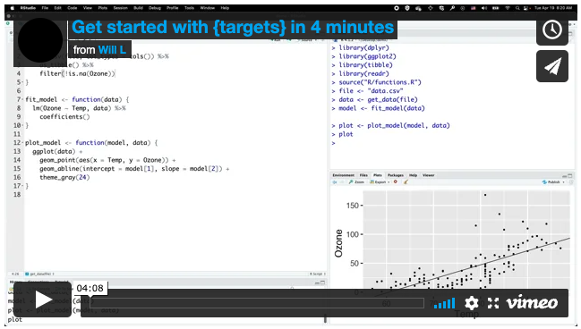

# targets 

[](https://github.com/ropensci/software-review/issues/401)
[](https://doi.org/10.21105/joss.02959)
[](https://zenodo.org/badge/latestdoi/200093430)
[](https://wlandau.github.io/targetopia/)
[](https://CRAN.R-project.org/package=targets)
[](https://www.repostatus.org/#active)
[](https://github.com/ropensci/targets/actions?query=workflow%3Acheck)
[](https://app.codecov.io/gh/ropensci/targets)
[](https://github.com/ropensci/targets/actions?query=workflow%3Alint)

Pipeline tools coordinate the pieces of computationally demanding
analysis projects. The `targets` package is a
[Make](https://www.gnu.org/software/make/)-like pipeline tool for
statistics and data science in R. The package skips costly runtime for
tasks that are already up to date, orchestrates the necessary
computation with implicit parallel computing, and abstracts files as R
objects. If all the current output matches the current upstream code and
data, then the whole pipeline is up to date, and the results are more
trustworthy than otherwise.

## Philosophy

A pipeline is a computational workflow that does statistics, analytics,
or data science. Examples include forecasting customer behavior,
simulating a clinical trial, and detecting differential expression from
genomics data. A pipeline contains tasks to prepare datasets, run
models, and summarize results for a business deliverable or research
paper. The methods behind these tasks are user-defined R functions that
live in R scripts, ideally in a folder called `"R/"` in the project. The
tasks themselves are called “targets”, and they run the functions and
return R objects. The `targets` package orchestrates the targets and
stores the output objects to make your pipeline efficient, painless, and
reproducible.

## Prerequisites

1.  Familiarity with the [R programming
    language](https://www.r-project.org/), covered in [R for Data
    Science](https://r4ds.had.co.nz/).
2.  [Data science workflow management
    techniques](https://rstats.wtf/index.html).
3.  [How to write functions](https://r4ds.had.co.nz/functions.html) to
    prepare data, analyze data, and summarize results in a data analysis
    project.

## Installation

If you are using `targets` [with `crew` for distributed
computing](https://books.ropensci.org/targets/crew.html), it is
recommended to use `crew` version `0.4.0` or higher.

``` r
install.packages("crew")
```

There are multiple ways to install the `targets` package itself, and
both the latest release and the development version are available.

| Type        | Source   | Command                                                           |
|-------------|----------|-------------------------------------------------------------------|
| Release     | CRAN     | `install.packages("targets")`                                     |
| Development | GitHub   | `remotes::install_github("ropensci/targets")`                     |
| Development | rOpenSci | `install.packages("targets", repos = "https://dev.ropensci.org")` |

## Get started in 4 minutes

The 4-minute video at <https://vimeo.com/700982360> demonstrates the
example pipeline used in the
[walkthrough](https://books.ropensci.org/targets/walkthrough.html) and
[functions](https://books.ropensci.org/targets/functions.html) chapters
of the [user manual](https://books.ropensci.org/targets/). Visit
<https://github.com/wlandau/targets-four-minutes> for the code and
<https://rstudio.cloud/project/3946303> to try out the code in a browser
(no download or installation required).

[](https://vimeo.com/700982360)

## Usage

To create a pipeline of your own:

1.  [Write R
    functions](https://books.ropensci.org/targets/functions.html) for a
    pipeline and save them to R scripts (ideally in the `"R/"` folder of
    your project).
2.  Call
    [`use_targets()`](https://docs.ropensci.org/targets/reference/use_targets.html)
    to write key files, including the vital `_targets.R` file which
    configures and defines the pipeline.
3.  Follow the comments in `_targets.R` to fill in the details of your
    specific pipeline.
4.  Check the pipeline with
    [`tar_visnetwork()`](https://docs.ropensci.org/targets/reference/tar_visnetwork.html),
    run it with
    [`tar_make()`](https://docs.ropensci.org/targets/reference/tar_make.html),
    and read output with
    [`tar_read()`](https://docs.ropensci.org/targets/reference/tar_read.html).
    [More
    functions](https://docs.ropensci.org/targets/reference/index.html)
    are available.

## Documentation

- [User manual](https://books.ropensci.org/targets/): in-depth
  discussion about how to use `targets`. The most important chapters are
  the
  [walkthrough](https://books.ropensci.org/targets/walkthrough.html),
  [help guide](https://books.ropensci.org/targets/help.html), and
  [debugging guide](https://books.ropensci.org/targets/debugging.html).
- [Reference website](https://docs.ropensci.org/targets/): formal
  documentation of all user-side functions, the statement of need, and
  multiple design documents of the internal architecture.
- [Developer documentation](https://books.ropensci.org/targets-design/):
  software design documents for developers contributing to the deep
  internal architecture of `targets`.

## Help

Please read the [help
guide](https://books.ropensci.org/targets/help.html) to learn how best
to ask for help using `targets`.

## Courses

- [Carpentries
  workshop](https://carpentries-incubator.github.io/targets-workshop/)
  by [Joel Nitta](https://github.com/joelnitta)
- [Half-day interactive tutorial with a Keras
  example](https://github.com/wlandau/targets-tutorial)

## Selected talks

### English

- [Get started with `targets` in 4 minutes
  (4:08)](https://vimeo.com/700982360)
- [`targets` in Action](https://ropensci.org/commcalls/jan2023-targets/)
  with [Joel Nitta](https://github.com/joelnitta) and [Eric
  Scott](https://github.com/Aariq). rOpenSci Community Call (1:09:56).
- [`targets` and `crew` for clinical trial simulation
  pipelines](https://www.youtube.com/watch?v=cyF2dzloVLo&list=PLMtxz1fUYA5C0csy8-wTfFmRYQEB30vr3).
  R/Pharma 2023 (1:57:22).
- [`targets` and `stantargets` for Bayesian model validation
  pipelines](https://youtu.be/HJI5mQJRGpY). R/Medicine 2021 (15:33)
- [Reproducible computation at scale in R with
  `targets`](https://youtu.be/Gqn7Xn4d5NI) New York Open Statistical
  Programming Meetup, December 2020 (1:54:28).
- [ds-incubator series,
  2021](https://www.youtube.com/playlist?list=PLvgdJdJDL-APJqHy5CXs6m4N7hUVp5rb4)
  by [Mauro Lepore](https://github.com/maurolepore).

### Español

- [Introducción a targets](https://www.youtube.com/watch?v=Vj312AfdpBo).
  Irene Cruz, R-Ladies Barcelona, 2021-05-25 (1:25:12).

### 日本語

- [Bio”Pack”athon, 2022-03-31
  (1:04:10)](https://togotv.dbcls.jp/20220331.html), [Joel
  Nitta](https://github.com/joelnitta)

## Example projects

- [Four-minute example](https://github.com/wlandau/targets-four-minutes)
- [Minimal example](https://github.com/wlandau/targets-minimal)
- [Machine learning with
  Keras](https://github.com/wlandau/targets-keras)
- [Validate a minimal Stan
  model](https://github.com/wlandau/targets-stan)
- [Using Target Markdown and `stantargets` to validate a Bayesian
  longitudinal model for clinical trial data
  analysis](https://github.com/wlandau/rmedicine2021-pipeline)
- [Shiny app that runs a
  pipeline](https://github.com/wlandau/targets-shiny)
- [Deploy a pipeline to RStudio
  Connect](https://github.com/sol-eng/targets-deployment-rsc)

## Apps

- [`tar_watch()`](https://docs.ropensci.org/targets/reference/tar_watch.html):
  a built-in Shiny app to visualize progress while a pipeline is
  running. Available as a Shiny module via
  [`tar_watch_ui()`](https://docs.ropensci.org/targets/reference/tar_watch_ui.html)
  and
  [`tar_watch_server()`](https://docs.ropensci.org/targets/reference/tar_watch_server.html).
- [`targetsketch`](https://wlandau.shinyapps.io/targetsketch): a Shiny
  app to help sketch pipelines
  ([app](https://wlandau.shinyapps.io/targetsketch),
  [source](https://github.com/wlandau/targetsketch)).

## Deployment

- <https://solutions.rstudio.com/r/workflows/> explains how to deploy a
  pipeline to RStudio Connect ([example
  code](https://github.com/sol-eng/targets-deployment-rsc)).
- [`tar_github_actions()`](https://docs.ropensci.org/targets/reference/tar_github_actions.html)
  sets up a pipeline to run on GitHub Actions. The [minimal
  example](https://github.com/wlandau/targets-minimal) demonstrates this
  approach.

## Extending and customizing targets

- [R Targetopia](https://wlandau.github.io/targetopia/): a collection of
  [R packages](https://wlandau.github.io/targetopia/packages.html) that
  extend `targets`. [These
  packages](https://wlandau.github.io/targetopia/packages.html) simplify
  pipeline construction for specific fields of Statistics and data
  science.
- [Target
  factories](https://wlandau.github.io/targetopia/contributing.html#target-factories):
  a programming technique to write specialized interfaces for custom
  pipelines. Posts [here](https://ropensci.org/blog/2021/02/03/targets/)
  and [here](https://wlandau.github.io/targetopia/contributing.html)
  describe how.

## Code of conduct

Please note that this package is released with a [Contributor Code of
Conduct](https://ropensci.org/code-of-conduct/).

## Citation

``` r
citation("targets")
To cite targets in publications use:

  Landau, W. M., (2021). The targets R package: a dynamic Make-like
  function-oriented pipeline toolkit for reproducibility and
  high-performance computing. Journal of Open Source Software, 6(57),
  2959, https://doi.org/10.21105/joss.02959

A BibTeX entry for LaTeX users is

  @Article{,
    title = {The targets R package: a dynamic Make-like function-oriented pipeline toolkit for reproducibility and high-performance computing},
    author = {William Michael Landau},
    journal = {Journal of Open Source Software},
    year = {2021},
    volume = {6},
    number = {57},
    pages = {2959},
    url = {https://doi.org/10.21105/joss.02959},
  }
```
